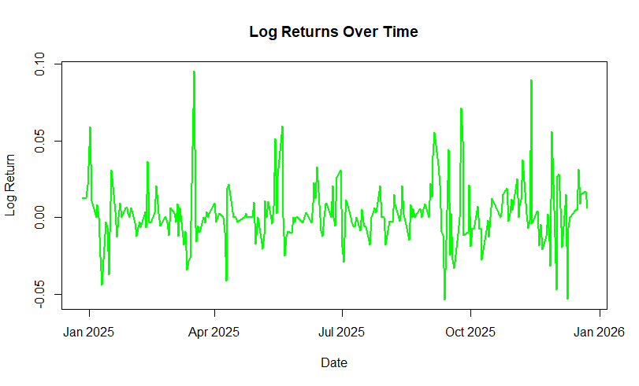
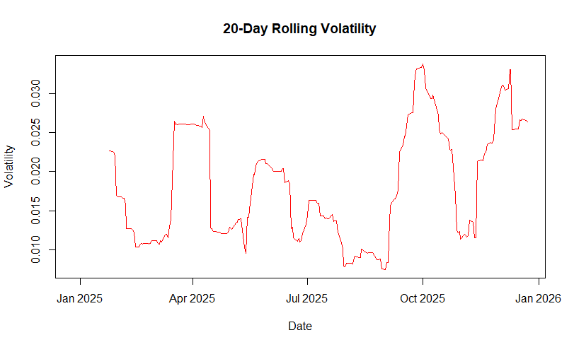
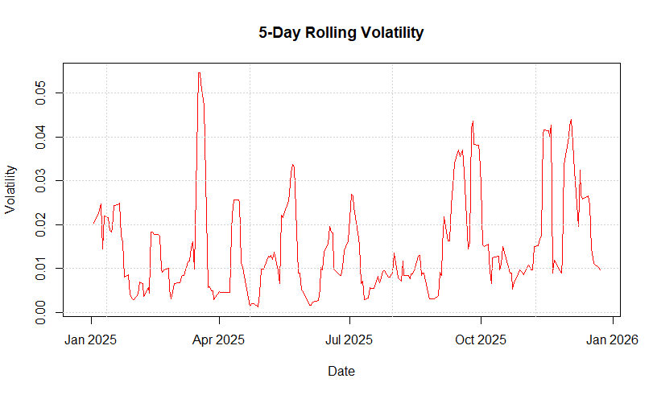
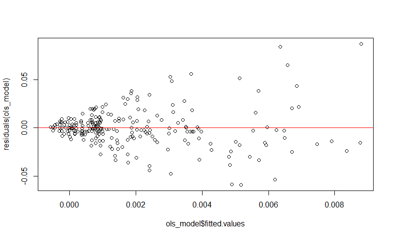
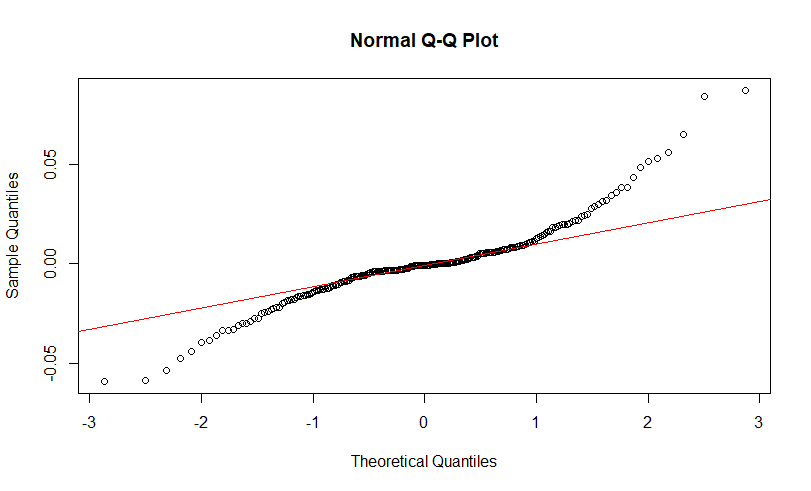

---

# Stock Price and Volatility Analysis (in R)

## Overview

This project performs a comprehensive time series analysis of stock price data to understand return behavior, volatility patterns, and risk dynamics.

The analysis is implemented in **R** and combines statistical testing, volatility estimation, and econometric modeling to explore how financial risk evolves over time.

---

## Objectives

* Clean and prepare stock price data for analysis
* Compute and analyze log returns
* Test for stationarity, autocorrelation, and heteroskedasticity
* Estimate and visualize volatility over time
* Model the relationship between risk and return
* Apply both OLS and Maximum Likelihood Estimation (MLE) methods

---

## Data

* **Source:** Stock price dataset (CSV format)
* **Key Variables:**

  * `Date` – Trading date
  * `Price` – Adjusted closing price
* **Derived Variable:**

  * `log_return` – Logarithmic return of prices

---

## Methodology

### 1. Data Cleaning and Preparation

* Selected relevant variables (Date and Price)
* Converted date to proper format
* Sorted data chronologically
* Checked and handled missing values

### 2. Exploratory Data Analysis

* Visualized stock price trends over time
* Computed and plotted log returns
* Identified patterns such as volatility clustering

### 3. Statistical Testing

* **Stationarity:** Augmented Dickey-Fuller (ADF) test
* **Autocorrelation:** ACF, PACF, and Ljung-Box test
* **Heteroskedasticity:** ARCH test

### 4. Volatility Analysis

* Computed overall volatility (standard deviation of returns)
* Estimated rolling volatility:

  * 5-day window
  * 20-day window
* Visualized time-varying volatility

### 5. Risk-Return Modeling

* Fitted OLS models:

  * Log returns vs 5-day volatility
  * Log returns vs 20-day volatility
* Interpreted relationship between risk and return

### 6. Model Diagnostics

* Residual analysis (mean, normality, independence)
* Breusch-Pagan test for heteroskedasticity
* Durbin-Watson test for autocorrelation

### 7. Maximum Likelihood Estimation (MLE)

* Defined a custom log-likelihood function
* Estimated parameters using MLE
* Compared results with OLS estimates

---

## Libraries Used

* `tidyverse` – Data manipulation
* `lubridate` – Date handling
* `tseries` – Stationarity testing
* `FinTS` – ARCH testing
* `zoo` – Rolling statistics
* `lmtest` – Model diagnostics
* `stats4` – Maximum Likelihood Estimation

---

## Visualizations

### Stock Price Over Time


Time plot of adjusted closing prices over the entire dataset.

---

### Log Returns


Daily log returns showing volatility clustering around zero.

---

### Rolling Volatility (20-day)


20-day rolling standard deviation capturing time-varying risk.

---

### Rolling Volatility (5-day)


5-day rolling volatility emphasizing short-term fluctuations.

---

### OLS Residuals


Residual plot from OLS model of log returns vs rolling volatility.

---

### OLS Q-Q Plot


Q-Q plot checking normality of OLS residuals.

---

## Usage

1. Clone the repository:

```bash
git clone <repository-url>
cd stock-volatility-analysis
```

2. Place the dataset and images in the project folder

3. Open the R Markdown notebook and run the analysis step by step

---

## Results

* Stock returns are stationary but exhibit volatility clustering
* ARCH effects confirm time-varying variance
* Rolling volatility captures dynamic risk behavior
* OLS models provide insight into the risk-return relationship
* MLE provides robust parameter estimates, complementing OLS

---

## Conclusion

This project demonstrates how statistical and econometric methods can be applied to financial time series data to understand risk and return dynamics.

It provides a foundation for advanced volatility modeling and forecasting, such as GARCH models.

---